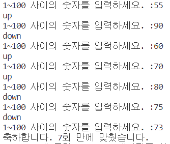
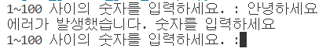
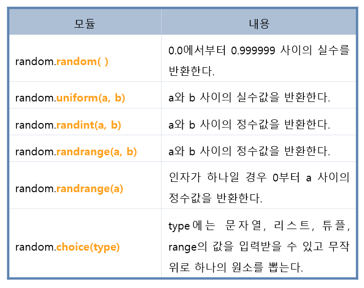

# Project 01. 숫자 맞추기 게임 만들기 

## **핵심요약** 
### 1부터 100까지의 임의의 수를 생성하고 생성된 임의의 수를 맞추는 게임 프로그램 <br></br>

## **조건** 
### 숫자를 하나 입력하면 임의로 생성된 수보다 높은지 낮은지 정답을 알려준다. 정답을 맞힌 경우 정답을 몇 번 만에 맞췄는지 결과로 알려주는 게임. <br></br>

## ● 임의의 숫자 생성 코드 만들기 (randomNumber.py)
### 1부터 100까지의 임의의 수를 하나 생성하여 생성된 임의의 수를 맞추는 게임 프로그램이므로 임의의 숫자를 먼저 생성해야 한다. 

```pyhton
# 임의의 숫자 생성 코드 만들기 

import random      # 랜덤 모듈 불러오기 

# random_number 변수에 1~100 사이의 임의의 값을 정수형태로 바인딩
random_number = random.randint(1, 100)    # (최소값, 최대값)

print(random_number)
```
<br></br>

## ● 숫자 맞추는 게임 코드 만들기 (check_figure_game.py)

```pyhton
# 숫자 맞추는 게임 만들기 

import random

# random_number 변수에 1~100 사이의 임의의 값을 정수형태로 바인딩
random_number = random.randint(1, 100)   

# 게임 횟수를 세기 위한 변수를 생성하고 1 값을 대입(바인딩)
game_count = 1 

while True :      # while의 조건이 True이기 때문에 break를 만나기 전까지 계속 반복됨. 
    my_number = int(input("1~100 사이의 숫자를 입력하세요. :"))   # 입력 값을 정수형으로 변환 후 my_number 변수에 저장 
    
    if my_number > random_number :  # 입력값이 임의의 수보다 크다면 
        print("down")               # down을 출력 
        
    elif my_number < random_number :  # 입력값이 임의의 수보다 작다면 
        print("up")                   # up을 출력 
            
    elif my_number == random_number :  # 입력값과 임의의 수 값이 같다면 (일치한다면)
        print(f"축하합니다. {game_count}회 만에 맞췄습니다.")   # 맞춘 횟수 출력 (f'string)
        break    # while 문 종료 
    
    game_count = game_count + 1   # while 문 반복 수행 시 count 값 1씩 증가 50
```

</img>
<br></br>

## ● 게임 코드 트러블 슈팅 – 예외처리 (game_except.py)
### 현재 int를 통해 입력된 문자 값을 숫자로 변환하는 작업을 하는데 숫자형을 입력받을 경우 해당 값을 숫자형으로 변환할 수 있지만, **문자를 입력받으면 숫자형으로 변환이 불가능하여 오류가 발생**한다. <br></br>

## **조건** 
### 사용자가 의도치 않게 문자를 입력할 경우, 프로그램이 종료되지 않도록 try except 구문을 사용하여 예외 처리를 한다. 

```pyhton
# 숫자 맞추는 게임 만들기(예외처리)

import random

# random_number 변수에 1~100 사이의 임의의 값을 정수형태로 바인딩
random_number = random.randint(1, 100)

# 게임 횟수를 세기 위한 변수를 생성하고 1 값을 대입(바인딩)
game_count = 1

while True:      # while의 조건이 True이기 때문에 break를 만나기 전까지 계속 반복됨.
    try :
        # 입력 값을 정수형으로 변환 후 my_number 변수에 저장
        my_number = int(input("1~100 사이의 숫자를 입력하세요. :"))

        if my_number > random_number:  # 입력값이 임의의 수보다 크다면
            print("down")               # down을 출력

        elif my_number < random_number:  # 입력값이 임의의 수보다 작다면
            print("up")                   # up을 출력

        elif my_number == random_number:  # 입력값과 임의의 수 값이 같다면 (일치한다면)
            print(f"축하합니다. {game_count}회 만에 맞췄습니다.")   # 맞춘 횟수 출력 (f'string)
            break    # while 문 종료

        game_count = game_count + 1   # while 문 반복 수행 시 count 값 1씩 증가 50
        
    except :    # 에러 발생 시 print문 출력 
        print("에러가 발생했습니다. 숫자를 입력하세요 ")

```

</img>
<br></br>

---
 <br></br>

# 사용한 문법
## ♣ try except 문  
### try 문을 사용한 코드 구간은 에러가 발생하지 않을 때 동작하는 구간이고, except 문을 사용한 코드 구간은 try 문 안의 코드에서 에러가 발생할 시 실행되는 구간이다.  <br></br>

## ♣ random 함수의 기능들  
</img>
<br></br>

---