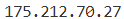

# Project 02. 컴퓨터의 외부 및 내부 IP 확인하기

## **핵심요약** 
### 자신의 컴퓨터의 외부 및 내부 IP를 확인할 수 있는 코드를 만들어보자. 가상환경 등으로 내부의 IP가 변경되더라도 정확한 IP를  찾을 수 있는 방법에 대해서 알아보자.  <br></br>

## ● 컴퓨터의 내부 IP를 알아보는 코드 만들기 (check_IP.py) 


```pyhton
#######  컴퓨터의 외부 및 내부 IP 확인하기 #######

# socket 모듈 : 컴퓨터가 연결된 접속 정보를 받아올 때 사용하는 모듈 
import socket   

ip_address = socket.gethostbyname(socket.gethostname())  

print(ip_address)
```
</img>
<br></br>

## ♣ gethostbyname( )함수 
### 주어진 호스트 name에 상응하는 hostent 타입의 구조체를 반환한다. name은 호스트이름이거나 표준점 표기법의 IPv4주소, 혹은 IPv6주소이다. <br></br>

## ♣ gethostname( )함수 
### Python 인터프리터가 현재 실행중인 시스템의 호스트 이름 값이 포함된 문자열을 반환하는 데 사용한다. gethostname( )함수를 사용하려면 socket 모듈을 불러와야 한다.  <br></br>

## ※ gethostname( )과 gethostbyname의 차이 ※ 
### **gethostname( )** 은 자기 자신의 이름을 얻는 함수이고, **gethostbyname**( )은 다른 녀석의 ip를 얻는 함수이다.  <br></br>

---
<br></br>

## ● 외부 사이트에 접속하고 접속된 정보를 바탕으로 내부 IP 확인하는 방법 (site_IPcheck.py)

```pyhton
#######  외부 사이트에 접속하고 접속된 정보를 바탕으로 내부 IP 확인하는 방법  #######

# socket 모듈 : 컴퓨터가 연결된 접속 정보를 받아올 때 사용하는 모듈 
import socket   

# socket 연결 / AF_INET : IP version 4 사용 
# SOCK_STREAM : 소켓에 TCP 패킷을 받겠다는 의미 
ip_address = socket.socket(socket.AF_INET, socket.SOCK_STREAM)

# goole 사이트로 연결, https 기본 접속 포트 443
ip_address.connect(("www.google.co.kr", 443))   

# 구글에서 반환한 현재 내부 IP 주소값 출력 
print(ip_address.getsockname()[0])
```

</img>
<br></br>

## ♣ 소켓 만드는 방법 (소켓 객체 생성) <br></br>
### <center>class socket.socket(family=AF_INET, type=SOCK_STREAM, proto=0, fileno=None) </center><br></br>
#### → 주소 패밀리, 소켓 유형, 및 프로토콜 번호를 사용하여 새로운 소켓을 생성한다.  <br></br>

### ① **주소 패밀리** : AF_INET (기본값), AF_INET6, AF_UNIX, AF_CAN, AF_PACKET 또는 AF_RDS여야 한다.
### ② **소켓 유형** : SOCK_STREAM (기본값), SOCK_DGRAM, SOCK_RAW 또는 기타 SOCK_ 상수 중 하나여야 한다.
### ③ **프로토콜 번호** : 일반적으로 0이며 생략될 수도 있고, 주소 패밀리가 AF_CAN 일 때 프로토콜은 CAN_RAW, CAN_BCM, CAN_ISOTP 또는 CAN_J1939 중 하나여야 한다.
### ④ **fileno** : family, type 및 proto 값이 지정된 파일 기술자에서 자동 감지된다. 명시적 family, type 또는 proto 인자를 사용하여 함수를 호출하면 자동 감지가 무효화 될 수 있다.  <br></br>

## ♣ getsockname 함수
### 지정된 소켓에 대한 로컬 이름 (인터페이스 어드레스와 포트 번호)를 얻어내는 함수이다. 달리 말하면 name 매개변수에 지정된 소켓 기술자에 대한 로컬 이름(name)을 반환한다.  →  주로 connect 함수를 호출하여 사용한다. <br></br>

---
<br></br>

## ● 컴퓨터 외부 IP 알아보는 코드 만들고 실행 (external_IP.py)
### 특정 사이트에 접속하여 외부 IP를 확인하는 방법을 코드로 작성해보자. 

```pyhton
#######  외부 사이트에 접속하고 접속된 정보를 바탕으로 외부 IP 확인하는 방법  #######

import requests   # python 용 http 라이브러리 
import re    # 정규 표현식 라이브러리 

req = requests.get("http://ipconfig.kr")    # 사이트 주소 열기 

# r string = raw string : escape 문이 작동하지 않고 문자열 그대로 출력하는 함수 
# \d{1,3}\.\d{1,3}\.\d{1,3}\.\d{1,3}) : \.는 . 문자를 나타내는 것이고 \d{1, 3}는 1에서 3사이의 단일 문자 출력을 의미한다. 
# req.text는 문자열 객체를 반환 
out_address = re.search(r'IP Address : (\d{1,3}\.\d{1,3}\.\d{1,3}\.\d{1,3})', req.text)[1]

print(out_address)

```

</img>
<br></br>

---
 <br></br>


## ● 컴퓨터 내부, 외부 IP 한번에 출력하는 코드 만들고 실행 (InExternal_IP.py)
```pyhton
#######  내부, 외부 IP 한번에 출력하는 방법  #######

import socket  # socket 모듈 : 컴퓨터가 연결된 접속 정보를 받아올 때 사용하는 모듈 
import requests   # python 용 http 라이브러리 
import re   # 정규표현식 라이브러리

# socket 연결 / AF_INET : IP version 4 사용 
# SOCK_STREAM : 소켓에 TCP 패킷을 받겠다는 의미 
ip_address = socket.socket(socket.AF_INET, socket.SOCK_STREAM)

# goole 사이트로 연결, https 기본 접속 포트 443
ip_address.connect(("www.google.co.kr", 443))   

# 구글에서 반환한 현재 내부 IP 주소값 출력 
print("내부 IP : ", ip_address.getsockname()[0])

req = requests.get("http://ipconfig.kr")    # 사이트 주소 열기 

# r string = raw string : escape 문이 작동하지 않고 문자열 그대로 출력하는 함수 
# \d{1,3}\.\d{1,3}\.\d{1,3}\.\d{1,3}) : \.는 . 문자를 나타내는 것이고 \d{1, 3}는 1에서 3사이의 단일 문자 출력을 의미한다. 
# req.text는 문자열 객체를 반환 
out_address = re.search(r'IP Address : (\d{1,3}\.\d{1,3}\.\d{1,3}\.\d{1,3})', req.text)[1]

print("외부 IP : ", out_address)
```

</img>
<br></br>

---
 <br></br>

# 사용한 문법
## ♣ requests 모듈 
### requests는 **python 사용자들을 위해 만들어진 간단한 Python용 HTTP 라이브러리**이다. HTTP, HTTPS 웹 사이트에 요청하기 위해 자주 사용되는 모듈 중 하나이고 Crawling 과정에서 requests 모듈을 이용해 웹 사이트의 소스 코드를 가져온 다음 파싱을 하는 경우가 많다.

### requests 모듈은 **[PUT, GET, POST, HEAD, PATCH, DELETE, OPTIONS]** 메서드가 존재한다.  <br></br>

### ①  **PUT 메소드**
#### put 메소드는 요청 시 PUT 방식으로 요청되며 data 매개변수를 지원한다.   <br></br>
### <center>requests.put(url, data=None, **kwargs) </center><br></br>

### ②  **GET 메소드**
####  get 메소드는 요청 시 GET 방식으로 요청되며 params 매개변수를 지원한다.   <br></br>
### <center>requests.get(url, params=None, **kwargs) </center><br></br>

### ③  **POST 메소드**
####  post 메소드는 요청 시 POST 방식으로 요청되며 data, json 매개변수가 존재한다.   <br></br>
### <center>requests.post(url, data=None, json=None, **kwargs) </center><br></br>

### ④  **HEAD 메소드**
#### head 메소드는 요청 시 HEAD 방식으로 요청된다.   <br></br>
### <center>requests.head(url, **kwargs)</center><br></br>

### ⑤  **PATCH 메소드**
#### patch 메소드는 요청 시 PATCH 방식으로 요청된다.  <br></br>
### <center>requests.patch(url, data=None, **kwargs) </center><br></br>

### ⑥  **DELETE 메소드**
#### delete 메소드는 요청 시 DELETE 방식으로 요청된다. <br></br>
### <center>requests.delete(url, **kwargs)</center><br></br>

### ⑦  **OPTIONS 메소드**
#### Options 메소드는 요청 시 OPTIONS 방식으로 요청된다. <br></br>
### <center>requests.options(url, **kwargs)</center><br></br>

## ♣ re 모듈 
### regex는 정규표현식으로 파이썬에서는 re 모듈을 사용한다. re 모듈을 제공해주는 함수들을 보면 **match(), fullmatch(), findall(), search()** 등이 있다. <br></br>

### ①  **match (패턴, 문자열, 플래그)**
#### match()는 문자열의 처음부터 시작해서 작성한 패턴이 일치하는지 확인한다. 문자열의 처음이 다르다면 매칭이 되지 않는다.  <br></br>

### ②  **search (패턴, 문자열, 플래그)**
#### search()는 match()와 유사하지만 패턴이 문자열의 처음부터 일치하지 않아도 괜찮다. 패턴과 일치만 한다면 문자열의 시작과는 상관없이 전부 찾아서 결과를 반환한다.  <br></br>

### ③  **findall (패턴, 문자열, 플래그)**
#### findall()은 문자열 안에 패턴에 맞는 케이스를 전부 찾아서 리스트로 반환한다.  <br></br>

### ④  **finditer (패턴, 문자열, 플래그)**
#### findall()과 유사하지만 패턴에 맞는 문자열의 리스트가 아닌 iterator 형식으로 반환한다. 해당 함수를 사용하는 목적은 패턴에 맞는 문자열과 어느 위치에 존재하는지를 확인할 때 사용한다. <br></br>

### ⑤  **fullmatch (패턴, 문자열, 플래그)**
#### fullmatch()는 문자열에 시작과 끝이 정확하게 패턴과 일치할 때 반환한다. match()는 처음부터 패턴에 맞으면 반환을 하지만 해당 함수는 시작과 끝이 정확하게 일치해야 한다.   <br></br>

### ⑥  **split (패턴, 문자열, 최대 split 수, 플래그)**
#### split은 문자열에서 패턴이 맞으면 이를 기점으로 리스트로 쪼개는 함수이다. 만약 3번째 인자(최대 split 수)를 지정하면 문자열을 지정한 수 만큼 쪼개고 그 수가 도달하면 쪼개지 않는다. <br></br>

### ⑦  **sub (패턴, 교체할 문자열, 문자열, 최대 교체 수, 플래그)**
#### sub는 문자열에 맞는 패턴을 2번째 인자(교체할 문자열)로 교체한다. split의 최대 split 수와 동일하게 최대 교체 수를 지정하면 문자열에 맞는 패턴을 교체할 문자열로 교체하고 그 수가 도달하면 더이상 교체하지 않는다. <br></br>

### ⑧  **compile (패턴, 플래그)**
#### 패턴과 플래그가 동일한 정규식을 여러번 사용하려면 compile()를 사용하여 지정한 다음, 위의 함수들을 사용할 수 있다. <br></br>

### ⑨  **purge( )**
#### scomplie( )로 만들어 놓은 객체는 캐시에 보통 100개까지 저장된다고 알려져 있으며 그 수를 넘어가면 초기화된다. purge( )를 호출하면 100개가 넘어가지 않아도 캐시를 초기화한다. <br></br>

### ⑩  **escape(패턴)**
#### escape()는 패턴을 입력 받으면 특수문자들에 이스케이프(백슬래쉬) 처리를 한 다음 반환한다. <br></br>

---