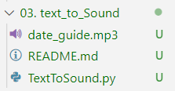

# Project 03. 텍스트를 음성으로 변환하기 

### **핵심요약** 
#### 텍스트를 한글 음성으로 변환하고 변환된 파일을 재생하여 출력하는 프로그램을 만들 수 있다.   <br></br>

### ● **라이브러리 설치**
#### ① **gtts 라이브러리** 
#### gtts 라이브러리는 문자를 음성으로 변환해주는 라이브러리이다. 

```pyhton
pip install gtts 
```
<br></br>

#### ② **playsound 라이브러리** 
#### playsound 라이브러리는 mp3 파일을 python에서 재생하기 위한 라이브러리이다. 

```pyhton
pip install playsound
```

<br></br>

---

<br></br>
### ● **텍스트를 음성으로 변환하는 코드 만들기 (TextToSound.py)**
####   해당 코드를 실행할 경우 폴더에 새로운 음성 파일이 생성된다. 

```pyhton
####### 텍스트를 음성으로 변환하는 코드 만들기 #######

from gtts import gTTS    # gtts 라이브러리로부터 gTTS 기능만 불러오기 

text = "오늘은 2023년 02월 16일입니다."  # text 변수에 문자열 바인딩

# text 변수 문자열을 ko(한글)로 변환하여 tts 변수에 바인딩
tts = gTTS(text=text, lang='ko')

# 프로젝트 폴더 안에 date_guide.mp3 파일 저장 
tts.save(r"03. text_to_Sound\date_guide.mp3")
```

</img>
<br></br>

---

<br></br>


### ● **텍스트를 음성으로 변환 후 바로 실행하는 코드 만들기 (TextToSound_Run.py)**
####  텍스트를 음성으로 변환 후 바로 해당 파일에서 실행시키는 방법을 구현해본다. 

```pyhton
####### 텍스트를 음성으로 변환 후 바로 실행하는 코드 만들기 #######

from gtts import gTTS    # gtts 라이브러리로부터 gTTS 기능만 불러오기 
from playsound import playsound  #playsound 라이브러리로부터 playsound 기능만 불러오기
import os   # 경로 이동시 꼭 필요한 os 라이브러리 

# 경로를 .py 파일의 현재 실행 경로로 이동 
os.chdir(os.path.dirname(os.path.abspath(__file__)))

# text 변수에 문자열 바인딩
text = "오늘은 2023년 02월 16일입니다."  

# text 변수 문자열을 ko(한글)로 변환하여 tts 변수에 바인딩
tts = gTTS(text=text, lang='ko')

# 현재 경로 안에 date_guide2.mp3 파일 저장 
tts.save("date_guide2.mp3")
playsound("date_guide2.mp3")

```
<br></br>

### **※ 주의사항 ※** 
#### 현재 상태로 코드 실행시 다음과 같은 에러 코드가 발생한다.
</img>
<br></br>

### **※ 해결방법 ※** 
#### playsound 라이브러리의 버전을 낮추면 해당 오류를 해결할 수 있다. 

```python
pip install playsound==1.2.2
```

### **실행결과**
</img>
<br></br>

---
<br></br>

### ● **텍스트 파일을 읽어와 음성으로 변환 후 바로 실행하는 코드 만들기 (loadTextSound.py)**
####  [나의 텍스트.txt] 파일을 생성하여 파일에서 문자를 읽어 음성으로 출력한다. 

```pyhton
####### 파일 텍스트를 불러와 음성으로 변환 후 바로 실행하는 코드 만들기 #######

from gtts import gTTS    # gtts 라이브러리로부터 gTTS 기능만 불러오기 
from playsound import playsound  #playsound 라이브러리로부터 playsound 기능만 불러오기
import os   # 경로 이동시 꼭 필요한 os 라이브러리 

# 경로를 .py 파일의 현재 실행 경로로 이동 
os.chdir(os.path.dirname(os.path.abspath(__file__)))

# 나의 텍스트.txt 경로를 바인딩  
file_path = "나의텍스트.txt"

# 파일 이름을 f로 오픈, 한글 파일 오픈시 글자가 깨지지 않게 지정 ㅊ 
with open(file_path, 'rt', encoding='UTF8') as f :
    read_file = f.read()

# text 변수 문자열을 ko(한글)로 변환하여 tts 변수에 바인딩
tts = gTTS(text=read_file, lang='ko')

# 현재 경로 안에 myText.mp3 파일 저장 
tts.save("myText.mp3")
playsound("myText.mp3")

```
<br></br>

### **실행결과**
</img>
<br></br>

---

<br></br>


### ● **csv 파일을 읽어와 음성으로 변환 후 바로 실행하는 코드 만들기 (csvloadSound.py)**
####  csv 파일을 불러와 해당 데이터들을 음성으로 변환 해 안내하는 프로그램을 만들 수 있다. 

```pyhton
####### csv 파일을 불러와 음성으로 변환 후 바로 실행하는 코드 만들기 #######

from gtts import gTTS    # gtts 라이브러리로부터 gTTS 기능만 불러오기 
from playsound import playsound  #playsound 라이브러리로부터 playsound 기능만 불러오기
import os   # 경로 이동시 꼭 필요한 os 라이브러리 

# 경로를 .py 파일의 현재 실행 경로로 이동 
os.chdir(os.path.dirname(os.path.abspath(__file__)))

# 자료.csv 경로를 바인딩  
file_path='자료.csv'

# 파일 이름을 f로 오픈, 
# 공공데이터는 cp949나 euc-kr 방식으로 인코딩이 되어 있기 때문에 
# encoding을 cp949로 설정해준다. 
with open(file_path,'rt',encoding='CP949')as f:
    read_file=f.read()

# csv 데이터 터미널에 출력 
print(read_file)

# text 변수 문자열을 ko(한글)로 변환하여 tts 변수에 바인딩
tts=gTTS(text=read_file,lang='ko')

# 현재 경로 안에 csvSound.mp3 파일 저장 & 바로 실행 
tts.save("csvSound.mp3")
playsound("csvSound.mp3")
```
<br></br>

### **실행결과**
</img>
</img>

<br></br>

---